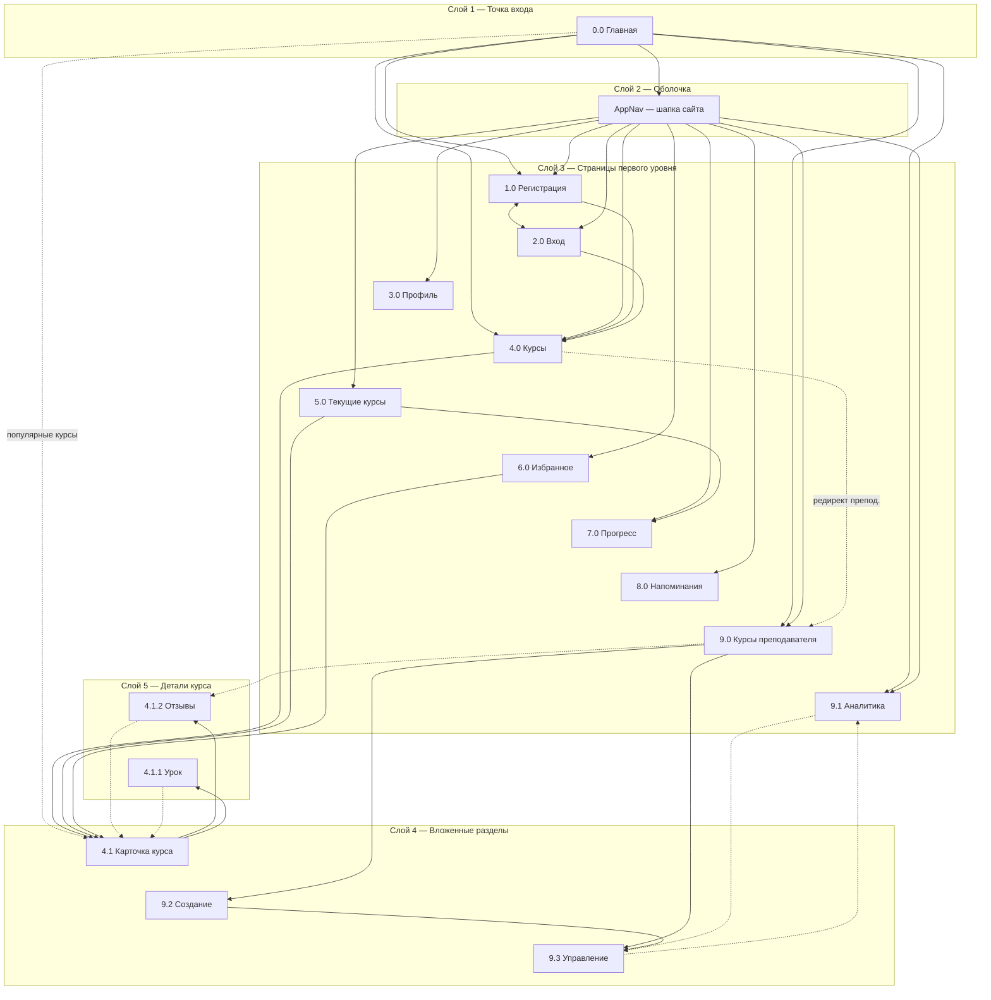

# 2 Проектирование дизайна web-страниц

Платформа VSVH Languages — одностраничное web-приложение (SPA) на React и TypeScript для изучения иностранных языков. В интерфейсе предусмотрены роли гость, студент и преподаватель (роль администратора в базе данных есть, отдельного интерфейса нет). Все страницы размещаются в общей оболочке: шапка сайта, область контента и подвал.

### Справочник страниц

| Код | Страница | Маршрут |
|-----|----------|---------|
| 0.0 | Главная | / |
| 1.0 | Регистрация | /register |
| 2.0 | Вход | /login |
| 3.0 | Профиль | /me/profile |
| 4.0 | Каталог курсов | /courses |
| 4.1 | Карточка курса | /courses/:courseId |
| 4.1.2 | Отзывы курса | /courses/:courseId/reviews |
| 4.1.1 | Урок | /courses/:courseId/lessons/:lessonId |
| 5.0 | Текущие курсы | /me/learning |
| 6.0 | Избранное | /me/favorites |
| 7.0 | Прогресс | /me/progress |
| 8.0 | Напоминания | /me/reminders |
| 9.0 | Курсы преподавателя | /teacher/courses |
| 9.2 | Создание курса | /teacher/courses/new |
| 9.3 | Управление курсом | /teacher/courses/:courseId |
| 9.1 | Аналитика | /teacher/analytics |

---

## 2.1 Структура web-приложения

Структура web-приложения представлена на рисунке 2.1. Схема построена послойно (сверху вниз): каждый слой — один горизонтальный уровень; сплошные стрелки между слоями идут только вниз, внутри слоя — горизонтальные связи.

Рисунок 2.1 – Структура web-приложения

Условные обозначения: сплошная стрелка — переход вниз по слоям или внутри одного слоя; пунктир — возврат на уровень выше (4.1.2, 4.1.1 → 4.1; 9.3 ↔ 9.1) или редирект/обход (4.0 → 9.0; с главной сразу на 4.1). Страницы 5.0, 6.0, 7.0, 8.0 на главной отдельными блоками не размещены — только слой 2 → слой 3 (шапка).

Сайт представляет собой иерархическую систему с главной страницей (0.0) в качестве центрального узла. С блоков главной (приветствие, популярные курсы, хаб преподавателя) выполняются переходы в каталог (4.0), карточку курса (4.1), кабинет преподавателя (9.0, 9.2, 9.1) или регистрацию (1.0). Из шапки на любой странице, включая главную, доступны регистрация (1.0), вход (2.0), профиль (3.0), каталог (4.0) или список курсов преподавателя (9.0), напоминания (8.0), аналитика (9.1 — только для преподавателя). У студента в выпадающем меню «Моё обучение» — страницы 5.0, 6.0, 7.0 и 8.0 (отдельных кнопок на эти разделы на главной нет).

Страницы регистрации (1.0) и входа (2.0) связаны перекрёстными ссылками под формами. После успешной регистрации или входа выполняется переход в каталог (4.0); для преподавателя маршрут /courses перенаправляется на список курсов преподавателя (9.0). Страницы восстановления пароля в приложении нет.

Со страницы каталога (4.0) при выборе курса открывается карточка курса (4.1). С карточки доступны все отзывы (4.1.2) и страница урока (4.1.1); урок по маршруту защищён авторизацией. Со страницы «Текущие курсы» (5.0) при выборе курса открывается карточка (4.1), с неё — урок (4.1.1). Со страницы избранного (6.0) по кнопке «Открыть» выполняется переход к карточке курса (4.1).

Со страницы курсов преподавателя (9.0) доступны создание курса (9.2), управление выбранным курсом (9.3) и аналитика (9.1); для опубликованных курсов — просмотр отзывов (4.1.2). После создания курса выполняется переход на страницу управления (9.3). Между управлением курсом и аналитикой предусмотрены взаимные ссылки.

При переходе на несуществующий адрес отдельная страница ошибки не отображается: выполняется перенаправление на главную (0.0).

| Страница | Доступ |
|----------|--------|
| 1.0, 2.0, 4.0, 4.1, 4.1.2 | Гость и авторизованные |
| 4.1.1 | Авторизованный пользователь |
| 3.0, 6.0, 8.0 | Любой авторизованный |
| 5.0, 7.0 | Студент |
| 9.0, 9.1, 9.2, 9.3 | Преподаватель |
| 4.0 для преподавателя | Редирект на 9.0 |

---

## 2.2 Текстовый прототип

Страницы web-приложения: Главная, Регистрация, Вход, Профиль, Каталог курсов, Карточка курса, Отзывы курса, Урок, Текущие курсы, Избранное, Прогресс, Напоминания, Курсы преподавателя, Создание курса, Управление курсом, Аналитика.

На всех страницах отображается единая шапка сайта: название приложения; пункты навигации в зависимости от роли (главная, каталог или «Мои курсы» для преподавателя, напоминания, аналитика); для студента — выпадающее меню «Моё обучение» (5.0, 6.0, 7.0, 8.0); для гостя — ссылки «Вход» (2.0) и «Регистрация» (1.0); для авторизованного пользователя — имя (переход к 3.0), меню «Настройки» (переключение светлой/тёмной темы, языка интерфейса RU/EN, сброс сохранённых настроек интерфейса) и кнопка выхода. На узких экранах навигация дублируется в выдвижной панели справа. При наступлении времени напоминания (опрос сервера каждые 30 с) в правом верхнем углу показывается всплывающее уведомление с заголовком, текстом напоминания, датой и кнопкой закрытия (закрытие удаляет напоминание). Подвал содержит служебную информацию (копирайт).

### Главная страница (0.0)

Страница является точкой входа в приложение (/). В верхней части расположен приветственный блок с заголовком, описанием платформы и двумя кнопками: основная ведёт в каталог курсов (4.0) для гостя и студента или в список курсов преподавателя (9.0) для роли преподаватель; вторая — «Создать аккаунт» (1.0) для гостя или контекстная ссылка для авторизованного («Текущие курсы», «Мои курсы» или профиль). Ниже расположены три карточки преимуществ и блок «Как это работает» (нумерованный список из четырёх шагов) и информационный блок с кратким описанием возможностей платформы.

Для гостя и студента отображается секция «Популярные курсы»: до четырёх карточек с названием, описанием, языком, уровнем, числом уроков и ссылкой «Открыть курс» (4.1); кнопки быстрых фильтров каталога (популярные, новые, английский, уровень beginner). При ошибке загрузки списка выводится сообщение об ошибке.

Для преподавателя вместо популярных курсов показывается хаб кабинета с тремя карточками-ссылками: управление курсами (9.0), создание курса (9.2), аналитика (9.1). В нижней части страницы — блок «Следующие шаги» со ссылками в зависимости от роли.

### Страница регистрации (1.0)

Страница содержит заголовок, краткое описание и карточку с формой регистрации. Поля формы: имя (обязательное, текст), email (обязательное), пароль (обязательное), выпадающий список роли «Студент» / «Преподаватель», кнопка «Зарегистрироваться» (при отправке отображается состояние ожидания). Под формой — текст «Уже есть аккаунт?» со ссылкой на страницу входа (2.0). Ошибки API (например, занятый email) отображаются красным текстом под полями. При успехе JWT сохраняется в localStorage, пользователь авторизуется и перенаправляется в каталог (4.0); для преподавателя далее срабатывает редирект на 9.0.

### Страница входа (2.0)

Страница содержит заголовок, описание и карточку с формой входа: поле email (обязательное), поле пароля (обязательное), кнопка «Войти». Ссылки «Забыли пароль?» нет. Под формой — ссылка на регистрацию (1.0). При неверных данных отображается сообщение об ошибке под формой. При успешном входе — сохранение JWT и переход в каталог (4.0) с учётом редиректа преподавателя на 9.0.

### Страница профиля (3.0)

Страница доступна только авторизованным пользователям (/me/profile). Содержит заголовок и описание. Блок «Данные профиля»: email (только для чтения), поле редактирования имени, кнопка «Сохранить»; при успешном сохранении отображается статусное сообщение. Блок «Сброс настроек интерфейса»: кнопка сброса темы, языка UI, фильтров и сортировки каталога, номера страницы каталога в localStorage. Сообщения об успехе или ошибке выводятся под карточками.

### Страница каталога курсов (4.0)

Страница содержит заголовок «Каталог курсов», описание и ссылку навигации «На главную» (0.0). Блок «Фильтры»: поле поиска по названию и описанию; выпадающий список языка (English, Spanish, German, French, Ukrainian, Polish); выпадающий список уровня (A1–C2); поле минимального рейтинга; выпадающий список сортировки (сначала новые, по рейтингу, по популярности, сначала старые); кнопка «Сбросить». Параметры фильтров, сортировки и номера страницы сохраняются в localStorage.

Блок «Курсы» с указанием общего числа: сетка карточек (по 8 на страницу). Каждая карточка содержит название, описание, язык, уровень, число уроков, средний рейтинг и число отзывов, ссылку «Открыть курс» (4.1). Внизу — пагинация: кнопки «Назад» / «Вперёд», отображение номера текущей страницы. При ошибке загрузки — сообщение об ошибке. Для преподавателя маршрут /courses перенаправляет на 9.0.

### Страница карточки курса (4.1)

Страница содержит заголовок (название курса), описание курса, навигацию «Все курсы» (4.0) и «На главную» (0.0). Блок «О курсе»: язык, уровень, средний рейтинг и число отзывов. Для студента — кнопки «Записаться» / «Отписаться», «В избранное» / «Убрать из избранного», ссылка «Отзывы» (4.1.2); при выполнении действий — статусное сообщение об успехе. Блок «Оцените курс» (только для студента): выпадающий список оценки 1–5, поле комментария (до 1000 символов), кнопка «Сохранить оценку»; сохранение доступно после записи на курс, иначе поясняющий текст.

Блок «Уроки»: список уроков с порядковым номером, названием, процентом прогресса, полосой прогресса, меткой «Завершён» / «В процессе» и ссылкой «Открыть» (4.1.1). При загрузке — индикатор «Загрузка…»; при отсутствии курса — «Курс не найден».

### Страница отзывов курса (4.1.2)

Страница содержит заголовок «Отзывы», подзаголовок с названием курса, навигацию к карточке курса (4.1) и каталогу (4.0). Секция «Отзывы (N)»: при загрузке — текст ожидания; при ошибке — сообщение; при пустом списке — «Пока нет отзывов»; иначе список карточек: имя автора, оценка x/5, комментарий (или «Без комментария»), дата. Внизу секции — ссылка «Вернуться к курсу» (4.1).

### Страница урока (4.1.1)

Страница доступна только авторизованным пользователям. Навигация вверх: к курсу (4.1), к каталогу (4.0), для студента — к «Текущим курсам» (5.0). Заголовок — название урока.

Для студента, не записанного на курс, отображается блок с пояснением и кнопками «Записаться на курс» и «Открыть курс» (4.1). Блок «Теория»: текст материала урока с сохранением переносов строк или сообщение «Теория не добавлена». Блок «Прогресс по курсу»: общий процент и прогресс по упражнениям текущего урока.

Блок «Упражнения»: для каждого упражнения — формулировка вопроса, поле ответа, кнопка «Отправить»; после проверки — результат (верно/неверно, балл). Отправка ответов доступна записанному на курс студенту; иначе поля и кнопки недоступны с пояснением. При наличии следующего урока — ссылка на него. Сообщения об ошибках отображаются над контентом.

### Страница «Текущие курсы» (5.0)

Страница доступна только студенту. Содержит заголовок, описание, навигацию к каталогу (4.0) и главной (0.0). Секция «Мои записи»: список записанных курсов. Каждый элемент — название курса, процент прогресса; кнопки «Перейти к курсу» (4.1), «Отписаться»; при прогрессе 100% без сертификата — «Выдать сертификат»; при выданном сертификате — номер, дата и «Скачать PDF». Ошибки операций отображаются в секции списка.

### Страница избранного (6.0)

Страница доступна авторизованному пользователю (в меню «Моё обучение» у студента). Содержит заголовок и описание. Секция «Избранные курсы»: список карточек с названием, языком и уровнем; кнопки «Открыть» (4.1) и «Удалить из избранного». При пустом списке карточки не отображаются. Ошибки загрузки — текст под заголовком секции.

### Страница прогресса (7.0)

Страница доступна только студенту. Навигация: «Текущие курсы» (5.0), каталог (4.0), главная (0.0). Блок «История активности»: хронологический список отправок — название упражнения, балл, дата и время. Блок «Отчёты»: кнопки «Скачать PDF» и «Скачать DOCX»; поле email и кнопка «Отправить на email» (при отсутствии SMTP на сервере возможен демо-режим с пояснением в статусе). Статусные сообщения отображаются под блоком отчётов.

### Страница напоминаний (8.0)

Страница доступна авторизованному пользователю (в шапке у преподавателя и в меню «Моё обучение» у студента). Блок «Новое напоминание»: поле заголовка, поле даты и времени (datetime-local), кнопка «Добавить»; при пустых полях — сообщение об ошибке; при успехе — сообщение об добавлении и очистка формы.

Блок «Ваши напоминания»: при пустом списке — «Пока нет напоминаний»; иначе список с заголовком и отформатированной датой, кнопками «Изменить» и «Удалить». В режиме редактирования — поля заголовка и времени, кнопки «Сохранить» и «Отмена». Успешные и ошибочные операции сопровождаются цветными статусными сообщениями вверху страницы.

### Страница курсов преподавателя (9.0)

Страница доступна только преподавателю. Содержит заголовок, описание, ссылку «На главную» (0.0). Секция «Мои курсы»: кнопка «Создать курс» (9.2); список собственных курсов. Каждая строка — название; подпись с языком, уровнем, числом уроков, студентов, рейтингом и числом отзывов; для опубликованного курса — кнопка «Отзывы» (4.1.2) и «Управлять» (9.3). При ошибке загрузки — сообщение под кнопкой создания.

### Страница создания курса (9.2)

Страница доступна только преподавателю. Навигация к списку курсов (9.0). Карточка «Новый курс» с формой: название (обязательное), описание (многострочное), выпадающие списки языка и уровня, кнопка «Создать курс». При ошибке — текст под формой. После успешного создания — переход на управление созданным курсом (9.3).

### Страница управления курсом (9.3)

Страница доступна только преподавателю. Заголовок включает название курса; навигация «К списку курсов» (9.0).

Секция «Содержание курса»: форма полей курса (название, описание, язык, уровень) и кнопка сохранения; форма добавления урока (заголовок, содержание, кнопка создания); для каждого урока — редактирование заголовка и содержания, изменение порядка, сохранение и удаление; для каждого урока — список упражнений с полями вопроса, максимального балла и эталонного ответа, кнопки создания, сохранения и удаления упражнений.

Секция «Студенты»: таблица записавшихся (имя, email, прогресс %, дни неактивности); фильтр по статусу (все / активные / неактивные); сортировка; кнопка «Скачать CSV».

Секция «Отчёты»: кнопки скачивания сводного отчёта PDF и DOCX по курсу, отправка отчёта на email преподавателя; статус операции. Ссылка на страницу аналитики (9.1) предусмотрена в навигации приложения и на странице аналитики — обратная ссылка на управление (9.3).

### Страница аналитики (9.1)

Страница доступна только преподавателю. Блок выбора курса и периода: выпадающий список курсов, период 7 / 30 / 90 дней, кнопка отправки отчёта на email (адрес берётся из профиля). Четыре KPI-карточки: число студентов, средний прогресс (%), активные за 7 дней, студенты «группы риска» (прогресс менее 40% или неактивность от 14 дней) с пояснением критерия.

График «Динамика отправок» (линейный): отправки и активные студенты по дням. «Распределение прогресса» (столбчатая диаграмма): диапазоны 0–25%, 26–50%, 51–75%, 76–100%. «Прогресс студентов»: переключатели «Все» / «Только группа риска», горизонтальная диаграмма прогресса до 12 студентов. При отсутствии данных — «Нет данных».

Нижний блок: ссылка «Управление курсом» (9.3), кнопки экспорта PDF, DOCX и CSV списка студентов по выбранному курсу.

---

## 2.3 Вайрфреймы web-страниц

Для web-приложения VSVH Languages разработаны вайрфреймы для всех страниц, описанных в текстовом прототипе (п. 2.2). На каждый рисунок приходится один вайрфрейм: для десктопа — отдельный макет каждой из шестнадцати страниц (рис. 2.2–2.17), для планшета — один обобщённый макет (рис. 2.18), для телефона — один обобщённый макет (рис. 2.19).

Вайрфреймы создаются с целью заложить структуру уникальных страниц и не упустить важные контентные блоки. На них наглядно изображены структура страницы, элементы интерфейса, расположение текстовых блоков и кнопок, пункты меню шапки и подвала, карточки курсов, формы, таблицы и блоки графиков. Проектирование вайфреймов выполнялось в приложении Figma.

После разработки вайрфреймов строится карта маршрутов пользователя (customer journey map), которая представлена в графической части пояснительной записки.

Рисунок 2.2 – Прототип главной страницы (0.0)

На макете показаны шапка сайта с логотипом и навигацией, приветственный блок с заголовком и описанием платформы, две основные кнопки (переход в каталог или к курсам преподавателя; регистрация или контекстная ссылка для авторизованного), три карточки преимуществ, блок «Как это работает», секция популярных курсов (карточки с языком, уровнем и ссылкой «Открыть курс») или хаб кабинета преподавателя, блок «Следующие шаги» и подвал.

Рисунок 2.3 – Прототип страницы регистрации (1.0)

На макете размещены шапка, заголовок и описание, карточка формы: поля имени, email, пароля, выпадающий список роли «Студент» / «Преподаватель», кнопка «Зарегистрироваться», ссылка на страницу входа, область сообщений об ошибке, подвал.

Рисунок 2.4 – Прототип страницы входа (2.0)

На макете показаны шапка, заголовок и описание, карточка формы: поля email и пароля, кнопка «Войти», ссылка на регистрацию, область сообщения об ошибке, подвал.

Рисунок 2.5 – Прототип страницы профиля (3.0)

На макете размещены шапка, заголовок страницы, блок «Данные профиля» (email, редактируемое имя, кнопка «Сохранить»), блок «Сброс настроек интерфейса», область статусных сообщений, подвал.

Рисунок 2.6 – Прототип страницы «Каталог курсов» (4.0)

На макете представлены шапка, заголовок «Каталог курсов», ссылка «На главную», панель фильтров (поиск, язык, уровень, рейтинг, сортировка, сброс), сетка карточек курсов с пагинацией, подвал.

Рисунок 2.7 – Прототип страницы карточки курса (4.1)

На макете показаны шапка, название и описание курса, навигация «Все курсы» и «На главную», блок «О курсе» (язык, уровень, рейтинг), кнопки записи и избранного, блок оценки курса, список уроков с прогрессом и ссылками «Открыть», подвал.

Рисунок 2.8 – Прототип страницы отзывов курса (4.1.2)

На макете изображены шапка, заголовок «Отзывы», подзаголовок с названием курса, навигация к карточке курса и каталогу, список карточек отзывов (автор, оценка, комментарий, дата), ссылка «Вернуться к курсу», подвал.

Рисунок 2.9 – Прототип страницы урока (4.1.1)

На макете показаны шапка, навигация к курсу, каталогу и «Текущим курсам», заголовок урока, блок «Теория», блок «Прогресс по курсу», список упражнений с полями ответа и кнопками «Отправить», ссылка на следующий урок, подвал.

Рисунок 2.10 – Прототип страницы «Текущие курсы» (5.0)

На макете отображены шапка, заголовок и описание раздела, навигация к каталогу и главной, секция «Мои записи»: список записанных курсов с процентом прогресса, кнопками «Перейти к курсу» и «Отписаться», блок выдачи сертификата при 100% прогресса, подвал.

Рисунок 2.11 – Прототип страницы «Избранное» (6.0)

На макете представлены шапка, заголовок и описание, секция «Избранные курсы»: карточки с названием, языком и уровнем, кнопки «Открыть» и «Удалить из избранного», подвал.

Рисунок 2.12 – Прототип страницы «Прогресс» (7.0)

На макете показаны шапка, навигация к «Текущим курсам», каталогу и главной, блок «История активности» (список отправок упражнений), блок «Отчёты» (скачивание PDF и DOCX, отправка на email), область статусных сообщений, подвал.

Рисунок 2.13 – Прототип страницы «Напоминания» (8.0)

На макете изображены шапка, блок «Новое напоминание» (заголовок, дата и время, кнопка «Добавить»), блок «Ваши напоминания» со списком записей и кнопками «Изменить» и «Удалить», область статусных сообщений, подвал.

Рисунок 2.14 – Прототип страницы «Курсы преподавателя» (9.0)

На макете показаны шапка с пунктами «Мои курсы» и «Аналитика», заголовок и описание, ссылка «На главную», кнопка «Создать курс», список курсов с метаданными, кнопки «Отзывы» и «Управлять», подвал.

Рисунок 2.15 – Прототип страницы создания курса (9.2)

На макете размещены шапка, навигация к списку курсов, карточка «Новый курс»: поля названия и описания, выпадающие списки языка и уровня, кнопка «Создать курс», область сообщения об ошибке, подвал.

Рисунок 2.16 – Прототип страницы управления курсом (9.3)

На макете представлены шапка, заголовок с названием курса, навигация «К списку курсов», секция «Содержание курса» (поля курса, уроки, упражнения), секция «Студенты» (таблица, фильтры, «Скачать CSV»), секция «Отчёты» (PDF, DOCX, email), подвал.

Рисунок 2.17 – Прототип страницы аналитики (9.1)

На макете показаны шапка, выбор курса и периода (7 / 30 / 90 дней), кнопка отправки отчёта на email, четыре KPI-карточки, график «Динамика отправок», диаграмма «Распределение прогресса», блок «Прогресс студентов» с переключателем «Все» / «Только группа риска», ссылка на управление курсом и кнопки экспорта PDF, DOCX, CSV, подвал.

Рисунок 2.18 – Прототип главной страницы для планшетных устройств (0.0)

На макете показана адаптация главной страницы под ширину планшета: компактная шапка, одноколоночное расположение приветственного блока и карточек, вертикальный стек секций «Популярные курсы», при необходимости — выдвижная панель навигации, подвал.

Рисунок 2.19 – Прототип главной страницы для мобильных устройств (0.0)

На макете показана адаптация главной страницы под ширину телефона: узкая шапка с кнопкой вызова меню, полноширинные кнопки и карточки, вертикальная прокрутка всех блоков контента, подвал.

---

## 2.4 Дизайн-макеты web-страниц

В рамках разработки сайта были созданы дизайн-макеты всех страниц, соответствующие текстовому прототипу (п. 2.2) и вайрфреймам (п. 2.3). Макеты разработаны для трёх основных типов устройств — десктоп, изображённый на рисунках 2.20 – 2.35, планшет — на рисунке 2.36, телефон — на рисунке 2.37.

Все разработанные дизайн-макеты включены в графический раздел курсовой работы.

Рисунок 2.20 – Дизайн-макет главной страницы (0.0)

Рисунок 2.21 – Дизайн-макет страницы регистрации (1.0)

Рисунок 2.22 – Дизайн-макет страницы входа (2.0)

Рисунок 2.23 – Дизайн-макет страницы профиля (3.0)

Рисунок 2.24 – Дизайн-макет страницы «Каталог курсов» (4.0)

Рисунок 2.25 – Дизайн-макет страницы карточки курса (4.1)

Рисунок 2.26 – Дизайн-макет страницы отзывов курса (4.1.2)

Рисунок 2.27 – Дизайн-макет страницы урока (4.1.1)

Рисунок 2.28 – Дизайн-макет страницы «Текущие курсы» (5.0)

Рисунок 2.29 – Дизайн-макет страницы «Избранное» (6.0)

Рисунок 2.30 – Дизайн-макет страницы «Прогресс» (7.0)

Рисунок 2.31 – Дизайн-макет страницы «Напоминания» (8.0)

Рисунок 2.32 – Дизайн-макет страницы «Курсы преподавателя» (9.0)

Рисунок 2.33 – Дизайн-макет страницы создания курса (9.2)

Рисунок 2.34 – Дизайн-макет страницы управления курсом (9.3)

Рисунок 2.35 – Дизайн-макет страницы аналитики (9.1)

Рисунок 2.36 – Дизайн-макет главной страницы для планшетных устройств (0.0)

Рисунок 2.37 – Дизайн-макет главной страницы для мобильных устройств (0.0)
