# 3.3 Разработка серверной части

Серверная часть платформы **VSVH Languages** реализована на **Node.js** с использованием фреймворка **Express** и предоставляет REST API с префиксом `/api` для клиентского SPA-приложения. Доступ к данным выполняется через Sequelize ORM (структура базы данных описана в разделе 3.2). Аутентификация построена на **JWT-токенах**: при успешной регистрации или входе клиент получает токен и передаёт его в заголовке `Authorization: Bearer …` при последующих запросах.

---

## Структура каталога server

Ниже структура серверной части описана «матрёшкой»: сначала перечисляется содержимое корня `server/`, затем по очереди раскрывается каждый вложенный каталог, упомянутый на предыдущем уровне.

### 1. Каталог `server/` (корень)

```
server/
├── app.js                 — фабрика Express-приложения
├── server.js              — точка входа HTTP-сервера
├── package.json           — зависимости и npm-скрипты workspace server
├── env.example            — образец переменных окружения (копируется в .env)
├── .sequelizerc           — пути для CLI Sequelize (миграции, конфиг)
├── config/                — конфигурация приложения
├── db/                    — подключение к БД и ORM-модели
├── middleware/            — промежуточные обработчики Express
├── routes/                — REST-маршруты API
├── services/              — прикладная бизнес-логика
├── utils/                 — вспомогательные функции
├── database/              — сиды и миграции схемы БД
└── tests/                 — интеграционные тесты API
```

**Файлы в корне**

| Файл | Назначение |
|------|------------|
| `server.js` | Загружает `.env`, создаёт приложение через `createApp()` из `app.js`, слушает порт `PORT` (по умолчанию 4000). |
| `app.js` | Настройка CORS и JSON, подключение всех роутеров из `routes/`, маршрут `GET /api/health`, глобальный обработчик ошибок (ответ 500). |
| `package.json` | Зависимости Node.js (Express, Sequelize, JWT, bcryptjs, Zod и др.) и команды `dev`, `db:migrate`, `db:seed`. |
| `env.example` | Шаблон `.env`: `DATABASE_URL`, `JWT_SECRET`, `JWT_EXPIRES_IN`, `CLIENT_ORIGIN`, при необходимости SMTP. |
| `.sequelizerc` | Указывает Sequelize CLI каталоги `database/migrations` и файл `db/config.cjs`. |

**Каталоги в корне** (раскрываются в п. 2–9).

Отдельный слой **controllers** не выделен: обработчики в `routes/` обращаются к моделям, `services/` и `utils/` напрямую.

---

### 2. Каталог `server/config/`

```
server/config/
└── authConfig.js          — секрет и срок жизни JWT из .env
```

| Файл | Назначение |
|------|------------|
| `authConfig.js` | Функции `getJwtSecret()` и `getJwtExpiresIn()`; читают `JWT_SECRET` и `JWT_EXPIRES_IN` из переменных окружения. Используется модулем `utils/jwt.js`. |

---

### 3. Каталог `server/db/`

```
server/db/
├── sequelize.js           — экземпляр Sequelize (подключение к PostgreSQL)
├── config.cjs             — параметры БД для CLI Sequelize
└── models/
    ├── index.js           — реэкспорт моделей и sequelize
    ├── constants.js       — коды платформенных ролей (STUDENT, TEACHER, ADMIN)
    ├── associations.js    — связи hasMany / belongsTo
    ├── Role.js … Reminder.js — определения ORM-моделей (по одному файлу на сущность)
```

| Файл / каталог | Назначение |
|----------------|------------|
| `sequelize.js` | Создаёт подключение Sequelize по строке `DATABASE_URL` из `.env`. Импортируется в `models/index.js`. |
| `config.cjs` | Конфигурация окружений (`development`, `test`, `production`) для команд `db:migrate` / `db:seed`. |
| `models/` | Слой доступа к данным через ORM (см. п. 4). |

---

### 4. Каталог `server/db/models/`

```
server/db/models/
├── index.js               — реэкспорт моделей, constants, sequelize
├── constants.js           — ROLE_CODES и служебные константы моделей
├── associations.js        — связи между моделями
├── Role.js
├── User.js
├── UserRole.js
├── Course.js
├── CourseStaff.js
├── CourseReview.js
├── Lesson.js
├── Exercise.js
├── Enrollment.js
├── Certificate.js
├── Submission.js
├── Favorite.js
└── Reminder.js
```

Каждая сущность БД (структура таблиц — в разделе 3.2) описана в отдельном файле; `index.js` собирает публичный API слоя моделей:

| Модель | Файл | Таблица (логически) | Кратко |
|--------|------|---------------------|--------|
| `Role` | `Role.js` | `roles` | Коды ролей: STUDENT, TEACHER, ADMIN |
| `User` | `User.js` | `users` | Пользователь: email, пароль (хеш), имя |
| `UserRole` | `UserRole.js` | `user_roles` | Связь пользователя с ролью |
| `Course` | `Course.js` | `courses` | Курс: язык, уровень, публикация, рейтинг |
| `CourseStaff` | `CourseStaff.js` | `course_staff` | Связь преподавателя с курсом (роль TEACHER); при создании курса создатель добавляется в эту таблицу |
| `CourseReview` | `CourseReview.js` | `course_reviews` | Отзыв студента на курс |
| `Lesson` | `Lesson.js` | `lessons` | Урок курса |
| `Exercise` | `Exercise.js` | `exercises` | Упражнение урока |
| `Enrollment` | `Enrollment.js` | `enrollments` | Запись студента на курс |
| `Certificate` | `Certificate.js` | `certificates` | Сертификат о прохождении |
| `Submission` | `Submission.js` | `submissions` | Ответ студента на упражнение |
| `Favorite` | `Favorite.js` | `favorites` | Избранный курс |
| `Reminder` | `Reminder.js` | `reminders` | Напоминание о занятии |

Связи `hasMany` / `belongsTo` настраиваются в `associations.js`; `index.js` импортирует их при загрузке и экспортирует `sequelize`. Отдельные роли участников курса (редактор, методист и т.п.) в приложении **не реализованы**: в `course_staff` фактически используется только роль **TEACHER**. Функция `canManageCourse` проверяет, что пользователь привязан к курсу как преподаватель (запись в `course_staff` с ролью TEACHER).

---

### 5. Каталог `server/middleware/`

```
server/middleware/
└── auth.js                — middleware requireAuth (JWT)
```

| Файл | Назначение |
|------|------------|
| `auth.js` | `requireAuth` — извлекает JWT из заголовка `Authorization`, проверяет токен, загружает пользователя (id, email, name, roles) в `req.authUser`. Проверка ролей (`STUDENT`, `TEACHER`) и прав на курс (`canManageCourse`) выполняется в маршрутах через `utils/permissions.js`, а не отдельным middleware. |

---

### 6. Каталог `server/routes/`

```
server/routes/
├── auth.js                — /api/auth
├── users.js               — /api/users
├── courses.js             — /api/courses
├── lessons.js             — /api/courses/:courseId/lessons
├── exercises.js           — /api/courses/.../exercises
├── enrollments.js         — /api/enrollments
├── submissions.js         — /api/submissions
├── certificates.js        — /api/certificates
├── favorites.js           — /api/favorites
├── reminders.js           — /api/reminders
├── teacher.js             — /api/teacher
└── reportsHttp.js         — /api/reports
```

Все роутеры подключаются в `app.js` напрямую; общий `routes/index.js` не используется.

| Файл | Префикс API | Содержание |
|------|-------------|------------|
| `auth.js` | `/api/auth` | Регистрация, вход, `GET /me` |
| `users.js` | `/api/users` | Профиль, обновление имени |
| `courses.js` | `/api/courses` | Каталог, карточка, отзывы, CRUD для преподавателя |
| `lessons.js` | `.../lessons` | Список и управление уроками |
| `exercises.js` | `.../exercises` | Упражнения урока |
| `enrollments.js` | `/api/enrollments` | Запись на курс, «моё обучение» |
| `submissions.js` | `/api/submissions` | Отправка ответов, история |
| `certificates.js` | `/api/certificates` | Выпуск и скачивание сертификатов |
| `favorites.js` | `/api/favorites` | Избранные курсы |
| `reminders.js` | `/api/reminders` | Напоминания студента |
| `teacher.js` | `/api/teacher` | Курсы преподавателя, студенты, экспорт CSV |
| `reportsHttp.js` | `/api/reports` | PDF/DOCX отчёты, аналитика, e-mail |

Служебный маршрут **`GET /api/health`** объявлен в `app.js`, а не в отдельном файле `routes/`.

---

### 7. Каталог `server/services/`

```
server/services/
├── activityService.js     — последняя активность по submissions
├── reportService.js       — агрегаты для отчётов и аналитики
└── courseStaffService.js  — ведущие преподаватели курсов
```

| Файл | Назначение |
|------|------------|
| `activityService.js` | Выборка последних ответов студентов (`Submission`) для отчётов. |
| `reportService.js` | Расчёт показателей курса для PDF/DOCX и `GET /api/reports/teacher-analytics`. |
| `courseStaffService.js` | Получение ведущих преподавателей по списку `courseId` (для каталога и записей). |

---

### 8. Каталог `server/utils/`

```
server/utils/
├── jwt.js                 — выпуск и проверка JWT
├── authUser.js            — DTO пользователя из БД
├── permissions.js         — hasRole, canManageCourse
├── progress.js            — пересчёт прогресса по урокам
└── pdf.js                 — генерация PDF (сертификаты, отчёты)
```

| Файл | Назначение |
|------|------------|
| `jwt.js` | `signAccessToken`, `verifyAccessToken`; использует `config/authConfig.js`. |
| `authUser.js` | `getAuthUserDtoById` — объект пользователя с ролями для ответа API. |
| `permissions.js` | `hasRole` (глобальные роли STUDENT, TEACHER), `canManageCourse` (преподаватель данного курса в `course_staff`) — проверки в обработчиках маршрутов. |
| `progress.js` | `recalculateProgress` — процент прохождения уроков по лучшим баллам. |
| `pdf.js` | `buildPdfBuffer` — формирование PDF-документов. |

---

### 9. Каталог `server/database/`

```
server/database/
├── seed.js                — заполнение БД демо-данными
└── migrations/
    ├── init-schema.sql
    ├── 20260410150000-initial-schema.cjs
    ├── 20260423110000-add-performance-indexes-and-checks.cjs
    ├── 20260507210000-reminders-timestamptz.cjs
    └── 20260507223000-drop-lesson-completions.cjs
```

| Файл / каталог | Назначение |
|----------------|------------|
| `seed.js` | Скрипт сидирования: тестовые пользователи, курсы, уроки, записи. Запуск: `npm run db:seed -w server`. Использует модели из `db/models/` и `utils/progress.js`. |
| `migrations/` | Версионирование схемы PostgreSQL через Sequelize CLI; `init-schema.sql` — справочный SQL-снимок схемы. |

---

### 10. Каталог `server/tests/`

```
server/tests/
└── app.integration.test.js — интеграционные проверки API
```

| Файл | Назначение |
|------|------------|
| `app.integration.test.js` | Тесты на базе `node:test` и `supertest`: проверка `createApp()` и ключевых эндпоинтов без отдельного запуска `server.js`. |

### Рисунок 3.2 — структура серверной части (диаграмма зависимостей)

На рисунке 3.2 показана структура каталога `server` и зависимости пакетов от точки входа приложения (`server.js`, `app.js`). Пунктирные стрелки соответствуют UML-зависимости «использует» (подключаемые модули и слои, задействованные при запуске API и сидировании БД). Точка входа HTTP — `server.js`; `app.js` только собирает Express-приложение. Модели лежат в `db/models/` (отдельные файлы на сущность), а не в корневой папке `models/`.

```mermaid
---
title: Зависимости пакетов server
---
flowchart LR
  subgraph pkg_server["Server"]
    direction TB
    s_env["+ env.example / .env"]
    s_srv["+ server.js"]
    s_app["+ app.js"]
  end

  subgraph pkg_database["database"]
    direction TB
    d_seed["+ seed.js"]
    d_mig["+ migrations/*.cjs"]
    d_sql["+ init-schema.sql"]
  end

  subgraph pkg_config["config"]
    c_auth["+ authConfig.js"]
  end

  subgraph pkg_middleware["middleware"]
    m_auth["+ auth.js"]
  end

  subgraph pkg_routes["routes"]
    direction TB
    r_auth["+ auth.js"]
    r_courses["+ courses.js"]
    r_lessons["+ lessons.js"]
    r_exercises["+ exercises.js"]
    r_enroll["+ enrollments.js"]
    r_cert["+ certificates.js"]
    r_sub["+ submissions.js"]
    r_fav["+ favorites.js"]
    r_rem["+ reminders.js"]
    r_teach["+ teacher.js"]
    r_rep["+ reportsHttp.js"]
    r_users["+ users.js"]
  end

  subgraph pkg_db["db"]
    direction TB
    db_seq["+ sequelize.js"]
    db_cfg["+ config.cjs"]
    subgraph pkg_models["models"]
      direction TB
      m_idx["+ index.js"]
      m_const["+ constants.js"]
      m_assoc["+ associations.js"]
      m_ent["Role.js · User.js · Course.js · …<br/>Lesson.js · Exercise.js · Reminder.js"]
    end
  end

  subgraph pkg_services["services"]
    direction TB
    sv_act["+ activityService.js"]
    sv_rep["+ reportService.js"]
    sv_staff["+ courseStaffService.js"]
  end

  subgraph pkg_utils["utils"]
    direction TB
    u_jwt["+ jwt.js"]
    u_auth["+ authUser.js"]
    u_perm["+ permissions.js"]
    u_prog["+ progress.js"]
    u_pdf["+ pdf.js"]
  end

  pkg_server -.-> pkg_config
  pkg_server -.-> pkg_middleware
  pkg_server -.-> pkg_routes
  pkg_server -.-> pkg_db
  pkg_server -.-> pkg_services
  pkg_server -.-> pkg_utils
  pkg_server -.-> pkg_database

  pkg_server ~~~ pkg_database
  pkg_config ~~~ pkg_middleware
  pkg_middleware ~~~ pkg_routes
  pkg_routes ~~~ pkg_services
  pkg_services ~~~ pkg_utils
```



Ниже приведено подробное описание каждого из маршрутов приложения.

---

## Маршруты API

### Аутентификация (`/api/auth`)

**POST /api/auth/register**

Маршрут для регистрации нового пользователя. Обработчик принимает поля `email`, `password`, `name` и опционально `role` (`teacher` назначает роль TEACHER, иначе STUDENT). Проверяет корректность e-mail и заполненность полей, хеширует пароль через **bcryptjs**, в транзакции создаёт запись в таблице Users и связанную запись в UserRoles. Возвращает объект пользователя (id, email, name, roles), JWT-токен и статус **201 Created**, либо **409 Conflict**, если пользователь с таким e-mail уже существует, либо **400 Bad Request** при некорректных данных.

**POST /api/auth/login**

Маршрут для входа в систему. Обработчик принимает поля `email` и `password`. Проверяет существование пользователя и корректность пароля через `bcryptjs.compare`. Возвращает объект пользователя и JWT-токен со статусом **200 OK** или **401 Unauthorized** при неверных учётных данных.

**GET /api/auth/me**

Маршрут для получения данных текущего авторизованного пользователя. Обработчик защищён middleware `requireAuth`, извлекает DTO пользователя из `req.authUser`. Возвращает объект пользователя со статусом **200 OK** или **401 Unauthorized** при отсутствии или недействительности токена.

---

### Профиль пользователя (`/api/users`)

**GET /api/users**

Маршрут для получения профиля текущего пользователя. Обработчик защищён `requireAuth`, загружает запись Users по id из токена. Возвращает поля `id`, `email`, `name`, `createdAt` или **404 Not Found**, если пользователь не найден.

**PUT /api/users**

Маршрут для обновления профиля. Обработчик принимает поле `name`, проверяет его непустоту через Zod. Обновляет имя пользователя в базе. Возвращает обновлённый профиль со статусом **200 OK** или **400 Bad Request** при некорректных данных.

---

### Курсы (`/api/courses`)

**GET /api/courses**

Маршрут для получения каталога опубликованных курсов. Обработчик принимает query-параметры: `language`, `level`, `minRating`, `search` (поиск по названию и описанию), `sort` (`createdAt`, `popularity`, `rating`), `order` (`asc`, `desc`), `page`, `limit`. Извлекает только курсы с `published: true`, добавляет агрегаты: число уроков, записей и отзывов, ведущего преподавателя. Возвращает объект с массивом `items`, `total`, `page`, `limit` или **400 Bad Request** при некорректных параметрах.

**GET /api/courses/:courseId**

Маршрут для получения карточки курса. Аутентификация **не обязательна**; при наличии валидного JWT в заголовке `Authorization` пользователь определяется опционально (`resolveOptionalAuthUser`). Обработчик извлекает опубликованный курс по id вместе с **ведущим преподавателем** (`leadTeacher`, из `course_staff`) и списком уроков (порядок, контент, число упражнений). Если в JWT есть роль STUDENT и пользователь записан на курс, для каждого урока рассчитывается процент прохождения по лучшим баллам за упражнения. Возвращает полный объект курса или **404 Not Found**.

**GET /api/courses/:courseId/reviews**

Маршрут для получения списка отзывов о курсе. Обработчик извлекает отзывы с данными авторов, отсортированные по дате. Возвращает массив `items` или **404 Not Found**, если курс не найден или не опубликован.

**GET /api/courses/:courseId/review/me**

Маршрут для получения собственного отзыва студента на курс. Обработчик защищён `requireAuth`, доступен только роли STUDENT. Возвращает объект `myReview` или `null`, если отзыв ещё не оставлен.

**POST /api/courses/:courseId/review**

Маршрут для создания или обновления отзыва. Обработчик принимает поля `rating` (1–5) и опционально `comment`. Проверяет роль STUDENT, наличие записи на курс (Enrollment). Создаёт новый отзыв или обновляет существующий в транзакции, пересчитывает `rating_average` курса. Возвращает `myReview`, `ratingAverage`, `reviewCount` или **403 Forbidden** / **404 Not Found** / **400 Bad Request**.

**POST /api/courses**

Маршрут для создания нового курса. Обработчик принимает поля `title`, `description`, `language`, `level`, опционально `published`. Доступен только глобальной роли TEACHER. В транзакции создаёт курс и записывает создателя в `course_staff` как преподавателя этого курса (роль TEACHER). Назначение других участников курса через API не предусмотрено. Возвращает созданный курс со статусом **201 Created** или **400 Bad Request** / **403 Forbidden**.

**PUT /api/courses/:courseId**

Маршрут для редактирования курса. Обработчик принимает любое подмножество полей `title`, `description`, `language`, `level`, `published`. Проверяет глобальную роль TEACHER и `canManageCourse` (пользователь — преподаватель данного курса). Возвращает обновлённый курс или **403 Forbidden** / **404 Not Found**.

**DELETE /api/courses/:courseId**

Маршрут для удаления курса. Обработчик проверяет глобальную роль TEACHER и `canManageCourse`, удаляет курс (каскадно — связанные уроки, записи и т.д.). Возвращает статус **204 No Content** или **403** / **404**.

---

### Уроки (`/api/courses/:courseId/lessons`)

**GET /api/courses/:courseId/lessons**

Маршрут для получения списка уроков курса. **Аутентификация не требуется.** Обработчик проверяет существование курса, возвращает объект `{ items: [...] }` с упорядоченными уроками (`id`, `title`, `content`, `order`) или **404 Not Found**. Поле `order` в JSON соответствует колонке `sort_order` в БД.

**GET /api/courses/:courseId/lessons/:lessonId**

Маршрут для получения одного урока. **Аутентификация не требуется.** Обработчик извлекает урок по id в рамках указанного курса. Возвращает объект урока или **404 Not Found**.

**POST /api/courses/:courseId/lessons**

Маршрут для добавления урока. Обработчик принимает `title`, опционально `content` и `order`. Требует роль TEACHER и `canManageCourse`. При отсутствии `order` назначает следующий порядковый номер. Возвращает созданный урок (**201**) или **403** / **404** / **400**.

**PUT /api/courses/:courseId/lessons/:lessonId**

Маршрут для редактирования урока. Обработчик обновляет `title`, `content`, `order`. Проверяет права преподавателя на курс. Возвращает обновлённый урок или ошибку **403** / **404** / **400**.

**DELETE /api/courses/:courseId/lessons/:lessonId**

Маршрут для удаления урока. Обработчик проверяет права и удаляет урок с упражнениями (каскад). Возвращает **204 No Content** или **403** / **404**.

---

### Упражнения (`/api/courses/:courseId/lessons/:lessonId/exercises`)

**GET /api/courses/:courseId/lessons/:lessonId/exercises**

Маршрут для получения списка упражнений урока. **Аутентификация не требуется.** Обработчик проверяет курс и урок, возвращает `{ items: [...] }` с полями `title`, `type`, `question`, `correctAnswer`, `maxScore`, `payload` (в том числе эталонный ответ — без скрытия для неавторизованных клиентов).

**POST /api/courses/:courseId/lessons/:lessonId/exercises**

Маршрут для создания упражнения. Обработчик принимает `title`, `question`, `type` (`text`, `single_choice`, `multiple_choice`), опционально `correctAnswer`, `maxScore`, `payload`. Требует TEACHER и `canManageCourse`. Сохраняет параметры задания в JSONB-поле `payload`. Возвращает созданное упражнение (**201**) или **403** / **404** / **400**.

**PUT /api/courses/:courseId/lessons/:lessonId/exercises/:exerciseId**

Маршрут для редактирования упражнения. Обработчик обновляет переданные поля, сохраняя остальные в `payload`. Возвращает обновлённое упражнение или **403** / **404** / **400**.

**DELETE /api/courses/:courseId/lessons/:lessonId/exercises/:exerciseId**

Маршрут для удаления упражнения. Обработчик проверяет права и удаляет запись. Возвращает **204 No Content** или **403** / **404**.

---

### Записи на курс (`/api/enrollments`)

**POST /api/enrollments**

Маршрут для записи студента на курс. Обработчик принимает `courseId`, доступен только STUDENT. Проверяет существование курса, создаёт запись с `progress: 0`. Возвращает enrollment (**201**), **409 Conflict** при повторной записи, **403** / **404** / **400**.

**GET /api/enrollments**

Маршрут для получения списка курсов текущего пользователя. Требуется `requireAuth` (глобальная роль STUDENT не проверяется). Обработчик возвращает `{ items: [...] }` с данными курса, ведущим преподавателем и сведениями о выданном сертификате (если есть), отсортированные по дате записи.

**DELETE /api/enrollments/:courseId**

Маршрут для отмены записи на курс. Обработчик доступен STUDENT, удаляет запись пользователя на указанный курс. Возвращает **204 No Content** или **404 Not Found**.

---

### Ответы на упражнения (`/api/submissions`)

**POST /api/submissions**

Маршрут для отправки ответа на упражнение. Обработчик принимает `exerciseId` и `answer`. Проверяет запись пользователя на курс (глобальная роль STUDENT **не** проверяется). Сравнивает ответ с эталоном из `payload.correctAnswer`, начисляет балл, сохраняет Submission, пересчитывает прогресс курса. Возвращает id отправки, балл, флаг `correct`, новый `progress` (**201**) или **403** / **404** / **400**.

**GET /api/submissions**

Маршрут для получения истории отправок текущего пользователя. Обработчик возвращает `{ items: [...] }` — до 200 последних записей с данными упражнения и урока.

---

### Сертификаты (`/api/certificates`)

**POST /api/certificates**

Маршрут для выдачи сертификата. Обработчик принимает `courseId`, доступен STUDENT. Проверяет запись на курс и `progress === 100`. Создаёт сертификат с уникальным `document_number` или возвращает уже существующий (идемпотентность). Возвращает сертификат (**201** или **200**), **409 Conflict**, если курс не завершён, **403** / **400**.

**GET /api/certificates/my**

Маршрут для списка сертификатов текущего пользователя. Обработчик возвращает `{ items: [...] }` с номером документа, датой выдачи и краткими данными курса.

**GET /api/certificates/:id/pdf**

Маршрут для скачивания сертификата в PDF. Обработчик проверяет, что сертификат принадлежит текущему пользователю, формирует PDF через `utils/pdf.js`. Возвращает файл `application/pdf` или **403 Forbidden** / **404 Not Found**.

---

### Избранное (`/api/favorites`)

**GET /api/favorites**

Маршрут для получения избранных курсов пользователя. Требуется `requireAuth` (роль STUDENT не обязательна). Обработчик возвращает `{ items: [...] }` с данными курса и ведущим преподавателем.

**POST /api/favorites**

Маршрут для добавления курса в избранное. Требуется `requireAuth`. Обработчик принимает `courseId`, использует `findOrCreate` для идемпотентного добавления. Возвращает `{ ok: true }` (**201**) или **404**, если курс не найден.

**DELETE /api/favorites/:courseId**

Маршрут для удаления курса из избранного. Обработчик удаляет запись пользователя. Возвращает **204 No Content**.

---

### Напоминания (`/api/reminders`)

**GET /api/reminders**

Маршрут для получения списка напоминаний текущего пользователя в виде `{ items: [...] }`, отсортированных по времени срабатывания.

**POST /api/reminders**

Маршрут для создания напоминания. Обработчик принимает `title`, `remindAt` (ISO datetime с часовым поясом), опционально `courseId`. Возвращает созданное напоминание (**201**) или **400 Bad Request**.

**PUT /api/reminders/:id**

Маршрут для изменения напоминания. Обработчик обновляет переданные поля, проверяет принадлежность записи пользователю. Возвращает обновлённый объект или **404 Not Found** / **400**.

**DELETE /api/reminders/:id**

Маршрут для удаления напоминания. Обработчик удаляет запись пользователя. Возвращает **204 No Content** или **404 Not Found**.

---

### Кабинет преподавателя (`/api/teacher`)

**GET /api/teacher/courses**

Маршрут для списка курсов, где текущий пользователь указан в `course_staff` как преподаватель (TEACHER). Обработчик возвращает `{ items: [...] }` с агрегатами: число уроков, записей, отзывов. Доступен только при глобальной роли TEACHER (**403** иначе).

**GET /api/teacher/courses/:courseId**

Маршрут для получения курса в режиме управления (включая неопубликованные). Обработчик проверяет `canManageCourse`, возвращает метаданные курса и список уроков с контентом.

**GET /api/teacher/courses/:courseId/students**

Маршрут для списка студентов курса. Обработчик принимает query `status` (`active` / `inactive` — активность за 14 дней), `sort` (`name`, `progress`, `activity`), `order` (`asc`, `desc`); параметры проверяются через Zod. Возвращает `{ items: [...] }` со студентами, прогрессом и датой последней активности.

**GET /api/teacher/courses/:courseId/students.csv**

Маршрут для экспорта списка студентов в CSV. Обработчик формирует файл с колонками name, email, progress, enrolledAt и отдаёт его как вложение `text/csv`.

---

### Отчёты (`/api/reports`)

**GET /api/reports/student-progress.pdf**

Маршрут для скачивания PDF-отчёта о прогрессе студента. Доступен STUDENT. Формирует документ по данным записей и баллам. Query `lang` (`ru` / `en`) задаёт язык подписей. Возвращает PDF или **404** / **403**.

**GET /api/reports/student-progress.docx**

Маршрут аналогичен предыдущему, но возвращает отчёт в формате DOCX.

**GET /api/reports/course-summary.pdf**

Маршрут для сводного PDF-отчёта по курсу. Доступен TEACHER с правом `canManageCourse`. Query-параметр `courseId` обязателен. Содержит число студентов, средний прогресс, список учащихся.

**GET /api/reports/course-summary.docx**

Маршрут аналогичен предыдущему для формата DOCX.

**GET /api/reports/teacher-analytics**

Маршрут для JSON-аналитики курса. Обработчик принимает query `courseId` и опционально `periodDays` (по умолчанию 30). Возвращает агрегированные показатели активности и прогресса или **400** / **403** / **404**.

**POST /api/reports/send-email**

Маршрут для отправки отчёта по e-mail. Обработчик принимает `type` (`student-progress` / `course-summary`), `format` (`pdf` / `docx`), для сводного отчёта — `courseId`, опционально `lang`. Формирует вложение и отправляет через SMTP; при отсутствии настроек SMTP возвращает demo-ответ о записи письма без отправки. Проверяет соответствующую роль (STUDENT или TEACHER).

---

### Служебный маршрут

**GET /api/health**

Маршрут для проверки доступности API. Обработчик возвращает JSON `{ ok: true }` со статусом **200 OK**. Аутентификация не требуется.

---

## Защита маршрутов и валидация

Все маршруты, требующие авторизации, защищены middleware **`requireAuth`**, который проверяет JWT-токен и записывает пользователя в **`req.authUser`** (не `req.user`). Дополнительные ограничения по глобальным ролям (**STUDENT**, **TEACHER**) и привязке к курсу как преподавателю (**`canManageCourse`**) выполняются в теле обработчиков. Без `requireAuth` доступны: `GET /api/health`, `GET /api/courses` (каталог), `GET /api/courses/:courseId` (с опциональным JWT), `GET` уроков и упражнений по вложенным путям, а также `POST /api/auth/register` и `POST /api/auth/login`. Отдельного middleware для роли ADMIN в текущей реализации нет: роль ADMIN хранится в базе, но выделенных административных эндпоинтов API не предусмотрено.

Валидация входных данных во всех файлах `routes/` выполняется библиотекой **Zod** (`safeParse` схем для тела запроса, query и параметров пути, где они принимаются) с сообщениями об ошибках на русском языке в теле ответа `{ error: "…" }`; для части маршрутов дополнительно возвращается массив `details` с путями полей. Ошибки уникальности на уровне Sequelize (дублирование e-mail, повторная запись на курс) обрабатываются кодом **409 Conflict**. Неперехваченные исключения передаются глобальному обработчику Express в `app.js` (отдельного файла `errorMiddleware.js` нет).

---

*См. также: [3-2-razrabotka-sloya-dostupa-k-dannym.md](./3-2-razrabotka-sloya-dostupa-k-dannym.md), [FUNCTIONAL_REQUIREMENTS.md](./FUNCTIONAL_REQUIREMENTS.md).*
