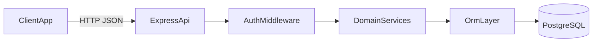

# 03. Архитектура, API и чеклист соответствия курсовой

Этот файл используется как рабочая инструкция для Cursor: что должно быть реализовано, как проверять и по каким критериям считать работу завершенной.

## 1) Проверка соответствия минимальным требованиям

Ниже два уровня: **целевое ТЗ** (документация) и **факт по репозиторию** (аудит кода). Цифры в скобках — пункты из задания курсовой.

### 1.1 Целевое состояние (по `docs/FUNCTIONAL_REQUIREMENTS.md`, `docs/PAGES_AND_FEATURES.md`)

Требования проработаны в документации; при полной реализации они закрывают все пункты курсовой.

### 1.2 Фактический статус по коду (аудит репозитория)

| Требование | Статус | Краткое обоснование |
|------------|--------|---------------------|
| (1) ≥2 ролей, разный функционал | **Missing** | Роли описаны в доках; в API нет JWT/role middleware, все маршруты — заглушки. |
| (2) Страницы входа и регистрации | **Partial** | Маршруты `/login`, `/register` есть; форм, запросов к API и состояния сессии нет. |
| (3) ≥7 страниц кроме auth | **Partial** | В [client/src/App.tsx](client/src/App.tsx) задано ≥11 маршрутов без auth; страницы — каркас текста без бизнес-UI. |
| (4) ≥15 функций (не auth) | **Missing** | Нет реализованных фильтров, сортировок, CRUD, отчётов и т.д. — только placeholder-текст на страницах. |
| (5) ≥2 отчёта (pdf/docx/email/…) | **Missing** | [server/routes/reportsHttp.js](server/routes/reportsHttp.js) — заглушка `GET /`. |
| (6) ≥20 разных типов компонентов | **Missing** | Нет каталога `client/src/components/` с реальными компонентами; MUI/Tailwind-классы в страницах не используются для UI-kit. |
| (7) Адаптив 1920→320, без гориз. скролла | **Missing** | Tailwind в зависимостях есть, но страницы не стилизованы под брейкпоинты. |
| (8) Интерактивность, hover, анимации | **Missing** | Нет кнопок/ссылок с реальными стилями состояний и анимаций. |
| (9) localStorage + сброс | **Missing** | `localStorage` в [client/](client/) не используется; кнопки сброса нет. |
| (10) ≥8 таблиц БД, 3НФ | **Partial** | В репозитории есть модели Sequelize ([server/db/models/index.js](server/db/models/index.js)), SQL-схема и миграция ([server/database/migrations](server/database/migrations)); маршруты Express пока не используют БД. |
| (11) REST + CRUD | **Partial** | В [server/server.js](server/server.js) смонтированы REST-префиксы; каждый файл в [server/routes/](server/routes/) — только `GET /` stub (см. [server/routes/README_STUBS.md](server/routes/README_STUBS.md)). |
| (12) Валидная семантическая вёрстка, React, Chrome | **Partial** | React + семантические теги на страницах есть; валидатор HTML и прогон в Chrome — вне кода; `recharts` в package.json, график не подключён. |
| (13) История коммитов по гайду | **N/A в коде** | Проверяется в git-истории; в репозитории зафиксированы правила Conventional Commits (раздел 15). |

**Итог аудита:** каркас фронта (маршруты + семантический скелет страниц) и каркас API (монтирование путей + health) есть; **критичная часть требований курсовой по функционалу, БД и UI пока не реализована**.

## 2) Технологический baseline (обязательный)

**Целевой стек (по README и ТЗ):** React, Redux Toolkit, Express, PostgreSQL, ORM **Sequelize**.

**Факт в репозитории:**
- **Frontend:** React + TypeScript + **Webpack** (`webpack`, `webpack-dev-server`, `ts-loader`); зависимости: `axios`, `@reduxjs/toolkit`, `react-redux`, `recharts`, Tailwind (PostCSS). Redux `Provider` и `store/` подключены в [client/src/main.tsx](client/src/main.tsx).
- **Backend:** Express; маршруты — **временные заглушки**, без слоёв controllers/services и без БД.
- **Database / ORM:** Sequelize — миграции и модели в `server/database/` и `server/db/`; подключение к PostgreSQL из приложения появится при реализации слоя доступа к данным.

**Repository model:** монорепозиторий с `client/` и `server/`.

## 3) Архитектурные принципы
- Слои backend: `routes -> controllers -> services -> data access`.
- Бизнес-логика не размещается в контроллерах и React-компонентах страниц.
- Ошибки API обрабатываются централизованно.
- Ролевой доступ проверяется в middleware.
- Контракты API не ломаются без версии/миграционного описания.

## 4) Целевая структура модулей

### Frontend (`client/src`)
- `api/` — запросы к backend и mapping DTO.
- `store/` — состояние приложения и асинхронные сценарии.
- `pages/` — маршруты и контейнеры страниц.
- `components/` — переиспользуемые UI-компоненты.
- `hooks/`, `utils/`, `types/`, `styles/` — общие абстракции.

### Backend (`server/`)
- `routes/` — REST-маршруты по доменным областям.
- `controllers/` — прием/ответ HTTP.
- `services/` — бизнес-правила.
- `middleware/` — auth/roles/validation/error.
- `models/` или ORM schema — данные, связи, ограничения.
- `config/` — окружение, БД, безопасность.

## 5) Data flow (высокоуровнево)

## 6) Обязательные API-группы (MVP)
- **Auth:** `register`, `login`, `me`.
- **Users:** профиль и обновление имени.
- **Courses:** list/detail/create/update/delete.
- **Lessons/Exercises:** чтение + teacher CRUD.
- **Enrollments:** enroll/list/unenroll/complete lesson.
- **Submissions:** submit + history.
- **Favorites/Reminders:** CRUD.
- **Teacher:** свои курсы, аналитика студентов, CSV.
- **Reports:** PDF/DOCX/email dispatch.
- **Ops:** `GET /api/health`.

Детали контрактов — в `docs/FUNCTIONAL_REQUIREMENTS.md`.

## 7) Инструкция для Cursor: как реализовывать

При любой задаче Cursor должен:
- Сначала определить, к какой доменной области относится изменение.
- Проверить раздел **1.2** (фактический статус): не путать целевое ТЗ с уже сделанным кодом.
- Проверить, не ломает ли изменение обязательные требования из раздела 1.
- При добавлении UI — использовать переиспользуемые компоненты, а не дублировать однотипную верстку.
- При добавлении endpoint — соблюдать CRUD-структуру и единый формат ошибок.
- Любой сценарий с ролями проверять минимум для `student` и `teacher`.
- Любые фильтры/сортировки/избранное сохранять в localStorage (если это пользовательские параметры UI).

## 8) Чеклист по страницам (минимум 7 без auth)

Обязательный набор страниц:
- `/` (главная)
- `/courses` (каталог)
- `/courses/:courseId` (карточка курса)
- `/courses/:courseId/lessons/:lessonId` (урок)
- `/me/learning` (мое обучение)
- `/me/progress` (прогресс/график/отчеты)
- `/me/reminders` (напоминания)
- `/teacher/courses` (кабинет преподавателя)

Дополнительно рекомендовано:
- `/me/favorites`
- `/me/profile`
- `/teacher/courses/:courseId`

## 9) Чеклист по функциям (минимум 15, кроме auth)

Минимальный список для фиксации:
1. Фильтрация каталога.
2. Сортировка каталога.
3. Пагинация каталога.
4. Поиск по курсам.
5. Запись на курс.
6. Отписка от курса.
7. Добавление в избранное.
8. Удаление из избранного.
9. Завершение урока.
10. Отправка ответа на упражнение.
11. Пересчет прогресса.
12. CRUD напоминаний.
13. CRUD курсов преподавателя.
14. CRUD уроков/упражнений преподавателя.
15. Экспорт CSV студентов.
16. Генерация отчета студента (PDF/DOCX).
17. Генерация отчета по курсу (PDF/DOCX).
18. Отправка отчета на e-mail.
19. График/визуализация прогресса.
20. Сброс пользовательских настроек localStorage.

## 10) Реестр компонентов (минимум 20 разных типов)

Обязательный контроль: считаются только разные типы компонентов, а не стили одного типа.

Рекомендуемый реестр:
1. Button
2. Input
3. Textarea
4. Select
5. Checkbox
6. RadioGroup
7. Switch
8. Card
9. Badge/Chip
10. Avatar
11. Modal/Dialog
12. Drawer/Sidebar
13. Tabs
14. Table
15. Pagination
16. Tooltip
17. Snackbar/Toast
18. Loader/Spinner
19. ProgressBar/CircularProgress
20. Chart component
21. Breadcrumbs
22. EmptyState

Минимум 20 типов из списка должны быть реально использованы в интерфейсе.

## 11) Адаптивность и интерактивность (обязательно)

### Адаптивность
- Проверка на ширинах: `1920`, `1440`, `1024`, `768`, `480`, `375`, `320`.
- На каждом брейкпоинте: отсутствует горизонтальный скролл, элементы не перекрываются, текст читабелен.

### Интерактивность
- Для интерактивных элементов заданы `hover`, `focus`, `active`, `disabled`.
- Курсор корректно меняется (`pointer`) там, где есть действие.
- Есть визуально различимые активные/неактивные состояния.
- Анимации плавные и не мешают использованию.

## 12) localStorage policy
- Сохраняются: фильтры, сортировки, пагинация, избранное и прочие пользовательские параметры.
- Есть явная кнопка `Сбросить настройки`, очищающая ключи приложения в localStorage.
- Очистка должна быть безопасной: удаляются только ключи префикса приложения (например, `vsvh:`).

## 13) База данных и 3НФ (минимум)
- Не менее 8 связанных таблиц.
- Исключены дубли данных и транзитивные зависимости.
- Для связей заданы PK/FK и ключевые ограничения уникальности.
- Наличие миграций для воспроизводимости схемы.

## 14) Технические требования (frontend)
- Используется React.
- Верстка семантическая (`header/main/nav/section/article/footer` где уместно).
- HTML валиден (критические ошибки разметки отсутствуют).
- Тест в Google Chrome последней версии обязателен.

## 15) Требования к коммитам
- История коммитов должна отражать реальный ход разработки.
- Формат сообщений: Conventional Commits.
- Примеры:
  - `feat: add teacher course analytics table`
  - `fix: correct enrollment progress recalculation`
  - `docs: update preproject architecture checklist`

## 16) Definition of Done для Cursor (этот файл)
Изменение считается готовым только если:
- Не нарушены минимальные требования из раздела 1 **по факту кода** (см. раздел 1.2 и 17–19), а не только по документации.
- Для затронутой функциональности пройдены проверки из разделов 8-15.
- Документация и контракты актуальны.

---

## 17) Фактический аудит по требованиям (матрица для Cursor)

Использовать как чеклист перед сдачей: каждая строка должна перейти минимум в **Implemented** или обоснованный **Partial** с планом закрытия.

| ID | Требование | Статус | Где смотреть / что сделать |
|----|------------|--------|----------------------------|
| R1 | Две роли, разный UX | Missing | Реализовать проверку ролей на сервере + разные маршруты/меню на клиенте по `docs/PAGES_AND_FEATURES.md`. |
| R2 | Login + Register | Partial | Добавить формы, вызовы API, хранение JWT (решение: memory + refresh или httpOnly cookie — зафиксировать). |
| R3 | ≥7 страниц без auth | Partial | Маршруты уже есть в `App.tsx`; наполнить страницы данными и действиями. |
| R4 | ≥15 функций | Missing | Реализовать сценарии из раздела 9 с привязкой к REST. |
| R5 | ≥2 отчёта | Missing | Реализовать `reports` по `FUNCTIONAL_REQUIREMENTS.md` (PDF/DOCX/email). |
| R6 | ≥20 типов компонентов | Missing | Создать `client/src/components/` и использовать типы из раздела 10 на реальных экранах. |
| R7 | Адаптив | Missing | Подключить Tailwind (или MUI Grid) к layout; пройти брейкпоинты из раздела 11. |
| R8 | Интерактивность | Missing | Общие стили `:hover/:focus`, `transition`, `cursor-pointer` на действиях. |
| R9 | localStorage + сброс | Missing | Ключи с префиксом `vsvh:`; кнопка на профиле — см. `PAGES_AND_FEATURES.md`. |
| R10 | ≥8 таблиц 3НФ | Missing | Добавить схему ORM + миграции; сверить с разделом «Данные» в `FUNCTIONAL_REQUIREMENTS.md`. |
| R11 | REST CRUD | Partial | Заменить заглушки в `server/routes/*.js` на полные handlers + сервисы. |
| R12 | React, семантика, валидность | Partial | Прогнать сборку; проверить HTML валидатором; финальный smoke в Chrome. |
| R13 | Conventional Commits | N/A | Вести историю по разделу 15. |

---

## 18) Доказательная база (артефакты репозитория)

| Артефакт | Назначение |
|----------|------------|
| [client/src/App.tsx](client/src/App.tsx) | Список маршрутов (страницы). |
| [client/src/pages/**/*.tsx](client/src/pages/) | Каркас страниц (семантика без бизнес-логики). |
| [client/src/main.tsx](client/src/main.tsx) | Точка входа; Redux пока не подключён. |
| [client/package.json](client/package.json) | Зависимости (axios, RTK, recharts, tailwind). |
| [server/server.js](server/server.js) | Монтирование `/api/*`, рабочий `GET /api/health`, CORS, глобальный `500` handler. |
| [server/routes/README_STUBS.md](server/routes/README_STUBS.md) | Официальное описание состояния API. |
| [server/routes/*.js](server/routes/) | Заглушки по одному `GET /` на модуль. |
| [docs/FUNCTIONAL_REQUIREMENTS.md](../FUNCTIONAL_REQUIREMENTS.md) | Контракты и критерии приёмки для реализации. |
| [docs/PAGES_AND_FEATURES.md](../PAGES_AND_FEATURES.md) | Карта экранов и связь с API. |

---

## 19) Gap list и приоритеты закрытия

Рекомендуемый порядок для Cursor (от блокирующих к защите):

1. **P0 — Данные и API:** схема БД (≥8 таблиц, 3НФ), миграции, реализация маршрутов по `FUNCTIONAL_REQUIREMENTS.md`, JWT и role middleware.
2. **P0 — Связка клиент–сервер:** `client/src/api/`, базовый `axios` + interceptors, Redux store или иной согласованный state для auth и списков.
3. **P1 — Функции курсовой:** каталог (фильтр/сорт/пагинация), enroll, уроки, submissions, teacher CRUD, отчёты.
4. **P1 — UI-kit:** минимум 20 именованных компонентов в `components/`, единые стили состояний.
5. **P2 — localStorage и сброс:** сохранение настроек каталога + кнопка очистки на профиле.
6. **P2 — Адаптив и полировка:** брейкпоинты, график (recharts) на `/me/progress`, snackbar для действий.
7. **P3 — Сдача:** валидатор HTML, скриншоты/чеклист Chrome, история коммитов по Conventional Commits.

---

## 20) Definition of Done перед сдачей курсовой (финальный)

Проект считается готовым к защите по минимальным требованиям, если одновременно:

- В разделе **1.2** нет статуса **Missing** по пунктам (1)–(11), либо каждый **Partial** закрыт письменным исключением (неприменимо к теме — только по согласованию с руководителем).
- Есть работающая БД с миграциями и демонстрацией связей (ER-диаграмма или список таблиц в `docs/`).
- Frontend вызывает реальный backend по всем ключевым сценариям из `PAGES_AND_FEATURES.md`.
- Выполнен ручной прогон: Chrome latest, ширины 1920 / 1440 / 768 / 375 / 320, отсутствие горизонтального скролла на типовых экранах.
- В репозитории видна осмысленная история коммитов с Conventional Commits.
