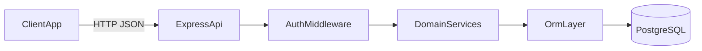

# 03. Архитектура, API и чеклист соответствия курсовой

Этот файл используется как рабочая инструкция для Cursor: что должно быть реализовано, как проверять и по каким критериям считать работу завершенной.

## 1) Проверка соответствия минимальным требованиям

Ниже два уровня: **целевое ТЗ** (документация) и **факт по репозиторию** (аудит кода). Цифры в скобках — пункты из задания курсовой.

### 1.1 Целевое состояние (по `docs/FUNCTIONAL_REQUIREMENTS.md`, `docs/PAGES_AND_FEATURES.md`)

Требования проработаны в документации; при полной реализации они закрывают все пункты курсовой.

### 1.2 Фактический статус по коду (аудит репозитория)

| Требование | Статус | Краткое обоснование |
|------------|--------|---------------------|
| (1) ≥2 ролей, разный функционал | **Implemented** | Роли `STUDENT`/`TEACHER` есть в БД и JWT-сессии; backend использует `requireAuth` и проверки прав на курс, frontend закрывает маршруты через `RequireAuth`. |
| (2) Страницы входа и регистрации | **Implemented** | `/login` и `/register` содержат формы, вызывают API и сохраняют сессию клиента. |
| (3) ≥7 страниц кроме auth | **Implemented** | В [client/src/App.tsx](../../client/src/App.tsx) задан набор публичных, student и teacher маршрутов: каталог, карточка, отзывы, урок, обучение, избранное, прогресс, напоминания, профиль, кабинеты преподавателя. |
| (4) ≥15 функций (не auth) | **Implemented** | Реализованы каталог с фильтрами/поиском/сортировкой/пагинацией, enroll/unenroll, избранное, уроки, submissions, пересчёт прогресса, teacher CRUD, CSV, отчёты, напоминания и сброс UI-настроек. |
| (5) ≥2 отчёта (pdf/docx/email/…) | **Implemented** | [server/routes/reportsHttp.js](../../server/routes/reportsHttp.js) отдаёт student/course PDF и DOCX, teacher analytics и отправку на e-mail с demo fallback без SMTP. |
| (6) ≥20 разных типов компонентов | **Partial** | UI использует переиспользуемые layout/auth/course-компоненты и Tailwind-стили, но финальный реестр 20 разных типов нужно подтвердить перед сдачей. |
| (7) Адаптив 1920→320, без гориз. скролла | **Partial** | Страницы используют responsive Tailwind-сетки и flex-layout; нужен финальный ручной прогон по брейкпоинтам. |
| (8) Интерактивность, hover, анимации | **Partial** | Базовые состояния интерактивных элементов вынесены в global styles/Tailwind-классы; перед сдачей нужен UI smoke. |
| (9) localStorage + сброс | **Implemented** | Настройки темы/языка/каталога сохраняются в `localStorage`; сброс UI-настроек доступен в навигации и профиле. |
| (10) ≥8 таблиц БД, 3НФ | **Implemented** | Схема содержит **13 таблиц** в [server/database/migrations/init-schema.sql](../../server/database/migrations/init-schema.sql), модели Sequelize — [server/db/models/index.js](../../server/db/models/index.js), история изменений — в Sequelize migrations. |
| (11) REST + CRUD | **Implemented** | [server/app.js](../../server/app.js) монтирует реальные REST-группы; статус route-модулей описан в [server/routes/README_STUBS.md](../../server/routes/README_STUBS.md). |
| (12) Валидная семантическая вёрстка, React, Chrome | **Partial** | React-приложение и семантические страницы реализованы; HTML-валидатор и финальный прогон Chrome остаются ручными gate-проверками. |
| (13) История коммитов по гайду | **N/A в коде** | Проверяется в git-истории; в репозитории зафиксированы правила Conventional Commits (раздел 15). |

**Итог аудита:** проект вышел за пределы каркаса: клиент, API, БД, роли, отчёты и основные пользовательские сценарии реализованы. Открытыми остаются финальные smoke/Chrome/адаптивные проверки и подтверждение полного UI-компонентного реестра.

## 2) Технологический baseline (обязательный)

**Целевой стек (по README и ТЗ):** React, Redux Toolkit, Express, PostgreSQL, ORM **Sequelize**.

**Факт в репозитории:**
- **Frontend:** React + TypeScript + **Webpack** (`webpack`, `webpack-dev-server`, `ts-loader`); зависимости: `axios`, `@reduxjs/toolkit`, `react-redux`, `recharts`, Tailwind (PostCSS). Redux `Provider` и `store/` подключены в [client/src/main.tsx](client/src/main.tsx).
- **Backend:** Express; доменные обработчики живут в `server/routes/`, общая логика вынесена в `server/services/` и `server/utils/`, auth/roles проходят через middleware и проверки прав на курс.
- **Database / ORM:** PostgreSQL; Sequelize — модели в `server/db/models/`, воспроизводимая схема через `server/database/migrations/init-schema.sql`, начальную миграцию и последующие `.cjs` миграции ([docs/DATABASE.md](../DATABASE.md)).

**Repository model:** монорепозиторий с `client/` и `server/`.

## 3) Архитектурные принципы
- Текущий backend: `routes -> services/utils -> Sequelize models`; отдельный `controllers/` слой не используется.
- Бизнес-логика не размещается в React-компонентах страниц; при росте route handlers её нужно выносить в `services/`.
- Ошибки API обрабатываются централизованно.
- Ролевой доступ проверяется в middleware.
- Контракты API не ломаются без версии/миграционного описания.

## 4) Целевая структура модулей

### Frontend (`client/src`)
- `api/` — запросы к backend и mapping DTO.
- `store/` — состояние приложения и асинхронные сценарии.
- `pages/` — маршруты и контейнеры страниц.
- `components/` — переиспользуемые UI-компоненты.
- `hooks/`, `utils/`, `types/`, `styles/` — общие абстракции.

### Backend (`server/`)
- `routes/` — REST-маршруты и HTTP handlers по доменным областям.
- `services/` — отчёты, активность и доменные операции, которые переиспользуются между route handlers.
- `middleware/` — auth/roles/validation/error.
- `db/models/` — Sequelize-модели, связи и ORM-описание.
- `database/migrations/` — SQL-источник схемы и Sequelize migrations.
- `config/` — окружение, БД, безопасность.

## 5) Data flow (высокоуровнево)

```mermaid
flowchart LR
  clientApp[ClientApp] -->|"HTTP JSON"| apiGateway[ExpressApi]
  apiGateway --> authMw[AuthMiddleware]
  authMw --> domainSvc[DomainServices]
  domainSvc --> ormLayer[OrmLayer]
  ormLayer --> pgDb[(PostgreSQL)]
```

## 6) Обязательные API-группы (MVP)
- **Auth:** `register`, `login`, `me`.
- **Users:** профиль и обновление имени.
- **Courses:** list/detail/create/update/delete.
- **Lessons/Exercises:** чтение + teacher CRUD.
- **Enrollments:** enroll/list/unenroll/complete lesson.
- **Submissions:** submit + history.
- **Favorites/Reminders:** CRUD.
- **Teacher:** свои курсы, аналитика студентов, CSV.
- **Reports:** PDF/DOCX/email dispatch.
- **Ops:** `GET /api/health`.

Детали контрактов — в `docs/FUNCTIONAL_REQUIREMENTS.md`.

## 7) Инструкция для Cursor: как реализовывать

При любой задаче Cursor должен:
- Сначала определить, к какой доменной области относится изменение.
- Проверить раздел **1.2** (фактический статус): не путать целевое ТЗ с уже сделанным кодом.
- Проверить, не ломает ли изменение обязательные требования из раздела 1.
- При добавлении UI — использовать переиспользуемые компоненты, а не дублировать однотипную верстку.
- При добавлении endpoint — соблюдать CRUD-структуру и единый формат ошибок.
- Любой сценарий с ролями проверять минимум для `student` и `teacher`.
- Любые фильтры/сортировки/избранное сохранять в localStorage (если это пользовательские параметры UI).

## 8) Чеклист по страницам (минимум 7 без auth)

Обязательный набор страниц:
- `/` (главная)
- `/courses` (каталог)
- `/courses/:courseId` (карточка курса)
- `/courses/:courseId/lessons/:lessonId` (урок)
- `/me/learning` (мое обучение)
- `/me/progress` (прогресс/график/отчеты)
- `/me/reminders` (напоминания)
- `/teacher/courses` (кабинет преподавателя)

Дополнительно рекомендовано:
- `/me/favorites`
- `/me/profile`
- `/teacher/courses/:courseId`

## 9) Чеклист по функциям (минимум 15, кроме auth)

Минимальный список для фиксации:
1. Фильтрация каталога.
2. Сортировка каталога.
3. Пагинация каталога.
4. Поиск по курсам.
5. Запись на курс.
6. Отписка от курса.
7. Добавление в избранное.
8. Удаление из избранного.
9. Завершение урока.
10. Отправка ответа на упражнение.
11. Пересчет прогресса.
12. CRUD напоминаний.
13. CRUD курсов преподавателя.
14. CRUD уроков/упражнений преподавателя.
15. Экспорт CSV студентов.
16. Генерация отчета студента (PDF/DOCX).
17. Генерация отчета по курсу (PDF/DOCX).
18. Отправка отчета на e-mail.
19. График/визуализация прогресса.
20. Сброс пользовательских настроек localStorage.

## 10) Реестр компонентов (минимум 20 разных типов)

Обязательный контроль: считаются только разные типы компонентов, а не стили одного типа.

Рекомендуемый реестр:
1. Button
2. Input
3. Textarea
4. Select
5. Checkbox
6. RadioGroup
7. Switch
8. Card
9. Badge/Chip
10. Avatar
11. Modal/Dialog
12. Drawer/Sidebar
13. Tabs
14. Table
15. Pagination
16. Tooltip
17. Snackbar/Toast
18. Loader/Spinner
19. ProgressBar/CircularProgress
20. Chart component
21. Breadcrumbs
22. EmptyState

Минимум 20 типов из списка должны быть реально использованы в интерфейсе.

## 11) Адаптивность и интерактивность (обязательно)

### Адаптивность
- Проверка на ширинах: `1920`, `1440`, `1024`, `768`, `480`, `375`, `320`.
- На каждом брейкпоинте: отсутствует горизонтальный скролл, элементы не перекрываются, текст читабелен.

### Интерактивность
- Для интерактивных элементов заданы `hover`, `focus`, `active`, `disabled`.
- Курсор корректно меняется (`pointer`) там, где есть действие.
- Есть визуально различимые активные/неактивные состояния.
- Анимации плавные и не мешают использованию.

## 12) localStorage policy
- Сохраняются: фильтры, сортировки, пагинация, избранное и прочие пользовательские параметры.
- Есть явная кнопка `Сбросить настройки`, очищающая ключи приложения в localStorage.
- Очистка должна быть безопасной: удаляются только ключи префикса приложения (например, `vsvh:`).

## 13) База данных и 3НФ (минимум)
- Не менее 8 связанных таблиц (**в проекте — 13**, см. [docs/DATABASE.md](../DATABASE.md)).
- Исключены дубли данных и транзитивные зависимости (с осознанными исключениями: кэш `rating_average`, JSONB в упражнениях/отправках — зафиксировано в `DATABASE.md`).
- Для связей заданы PK/FK и ключевые ограничения уникальности.
- Начальная миграция Sequelize применяет `init-schema.sql`; последующие `.cjs` миграции фиксируют эволюцию схемы.

## 14) Технические требования (frontend)
- Используется React.
- Верстка семантическая (`header/main/nav/section/article/footer` где уместно).
- HTML валиден (критические ошибки разметки отсутствуют).
- Тест в Google Chrome последней версии обязателен.

## 15) Требования к коммитам
- История коммитов должна отражать реальный ход разработки.
- Формат сообщений: Conventional Commits.
- Примеры:
  - `feat: add teacher course analytics table`
  - `fix: correct enrollment progress recalculation`
  - `docs: update preproject architecture checklist`

## 16) Definition of Done для Cursor (этот файл)
Изменение считается готовым только если:
- Не нарушены минимальные требования из раздела 1 **по факту кода** (см. раздел 1.2 и 17–19), а не только по документации.
- Для затронутой функциональности пройдены проверки из разделов 8-15.
- Документация и контракты актуальны.

---

## 17) Фактический аудит по требованиям (матрица для Cursor)

Использовать как чеклист перед сдачей: каждая строка должна перейти минимум в **Implemented** или обоснованный **Partial** с планом закрытия.

| ID | Требование | Статус | Где смотреть / что сделать |
|----|------------|--------|----------------------------|
| R1 | Две роли, разный UX | Implemented | `roles`/`user_roles`, JWT `requireAuth`, проверки `canManageCourse`, protected routes в `client/src/App.tsx`. |
| R2 | Login + Register | Implemented | Формы auth-страниц вызывают `client/src/api/authApi.ts`, JWT хранится в `localStorage` и используется API client. |
| R3 | ≥7 страниц без auth | Implemented | Маршруты и страницы перечислены в `client/src/App.tsx` и `client/src/pages/`. |
| R4 | ≥15 функций | Implemented | Основные сценарии реализованы в `client/src/api/`, `client/src/pages/` и `server/routes/`; перед сдачей сверить демонстрационный чеклист. |
| R5 | ≥2 отчёта | Implemented | `server/routes/reportsHttp.js` и `server/services/reportService.js`: PDF/DOCX/e-mail + teacher analytics. |
| R6 | ≥20 типов компонентов | Partial | UI-компоненты есть в `client/src/components/`, но финальный подсчёт 20 типов нужно подтвердить вручную. |
| R7 | Адаптив | Partial | Responsive Tailwind-классы есть; нужен ручной прогон ширин из раздела 11. |
| R8 | Интерактивность | Partial | Hover/focus/active состояния заданы в стилях и компонентах; нужен финальный UI smoke. |
| R9 | localStorage + сброс | Implemented | `client/src/constants/storage.ts`, каталог, тема/язык и кнопки сброса в профиле/навигации. |
| R10 | ≥8 таблиц 3НФ | **Implemented** | 13 таблиц, PK/FK/unique/indexes в `server/database/migrations/init-schema.sql`; модели — `server/db/models/index.js`. |
| R11 | REST CRUD | Implemented | Route-модули реализуют auth/courses/lessons/exercises/enrollments/favorites/reminders/teacher/reports; статус — `server/routes/README_STUBS.md`. |
| R12 | React, семантика, валидность | Partial | Прогнать сборку; проверить HTML валидатором; финальный smoke в Chrome. |
| R13 | Conventional Commits | N/A | Вести историю по разделу 15. |

---

## 18) Доказательная база (артефакты репозитория)

| Артефакт | Назначение |
|----------|------------|
| [client/src/App.tsx](client/src/App.tsx) | Список маршрутов (страницы). |
| [client/src/pages/**/*.tsx](client/src/pages/) | Реализованные страницы и контейнеры пользовательских сценариев. |
| [client/src/main.tsx](client/src/main.tsx) | Точка входа; подключение Redux Provider и глобальных стилей. |
| [client/package.json](client/package.json) | Зависимости (axios, RTK, recharts, tailwind). |
| [server/server.js](server/server.js) | Монтирование `/api/*`, рабочий `GET /api/health`, CORS, глобальный `500` handler. |
| [server/routes/README_STUBS.md](server/routes/README_STUBS.md) | Официальное описание состояния API. |
| [server/routes/*.js](server/routes/) | Реальные REST handlers по доменным областям. |
| [docs/FUNCTIONAL_REQUIREMENTS.md](../FUNCTIONAL_REQUIREMENTS.md) | Контракты и критерии приёмки для реализации. |
| [docs/DATABASE.md](../DATABASE.md) | Актуальная схема PostgreSQL (таблицы, ENUM, ограничения). |
| [docs/PAGES_AND_FEATURES.md](../PAGES_AND_FEATURES.md) | Карта экранов и связь с API. |

---

## 19) Gap list и приоритеты закрытия

Рекомендуемый порядок для Cursor (от блокирующих к защите):

1. **P0 — Данные и API:** схема БД (≥8 таблиц, 3НФ; см. [docs/DATABASE.md](../DATABASE.md)), реализация маршрутов по `FUNCTIONAL_REQUIREMENTS.md`, JWT и role middleware.
2. **P0 — Связка клиент–сервер:** `client/src/api/`, axios interceptor, Redux session state и страницы подключены к API.
3. **P1 — Функции курсовой:** каталог, enroll, уроки, submissions, teacher CRUD, отчёты и напоминания реализованы; поддерживать демонстрационный сценарий актуальным.
4. **P1 — UI-kit:** подтвердить минимум 20 именованных типов компонентов в `components/`/страницах и единые стили состояний.
5. **P2 — localStorage и сброс:** сохранение настроек каталога + кнопки очистки профиля/навигации реализованы; проверить только UX-текст и сценарий.
6. **P2 — Адаптив и полировка:** брейкпоинты, график (recharts) на `/me/progress`, финальный smoke действий.
7. **P3 — Сдача:** валидатор HTML, скриншоты/чеклист Chrome, история коммитов по Conventional Commits.

---

## 20) Definition of Done перед сдачей курсовой (финальный)

Проект считается готовым к защите по минимальным требованиям, если одновременно:

- В разделе **1.2** нет статуса **Missing** по пунктам (1)–(11), либо каждый **Partial** закрыт письменным исключением (неприменимо к теме — только по согласованию с руководителем).
- Есть работающая БД с миграциями и демонстрацией связей (ER-диаграмма или [docs/DATABASE.md](../DATABASE.md) + проверка по `init-schema.sql`).
- Frontend вызывает реальный backend по всем ключевым сценариям из `PAGES_AND_FEATURES.md`.
- Выполнен ручной прогон: Chrome latest, ширины 1920 / 1440 / 768 / 375 / 320, отсутствие горизонтального скролла на типовых экранах.
- В репозитории видна осмысленная история коммитов с Conventional Commits.
