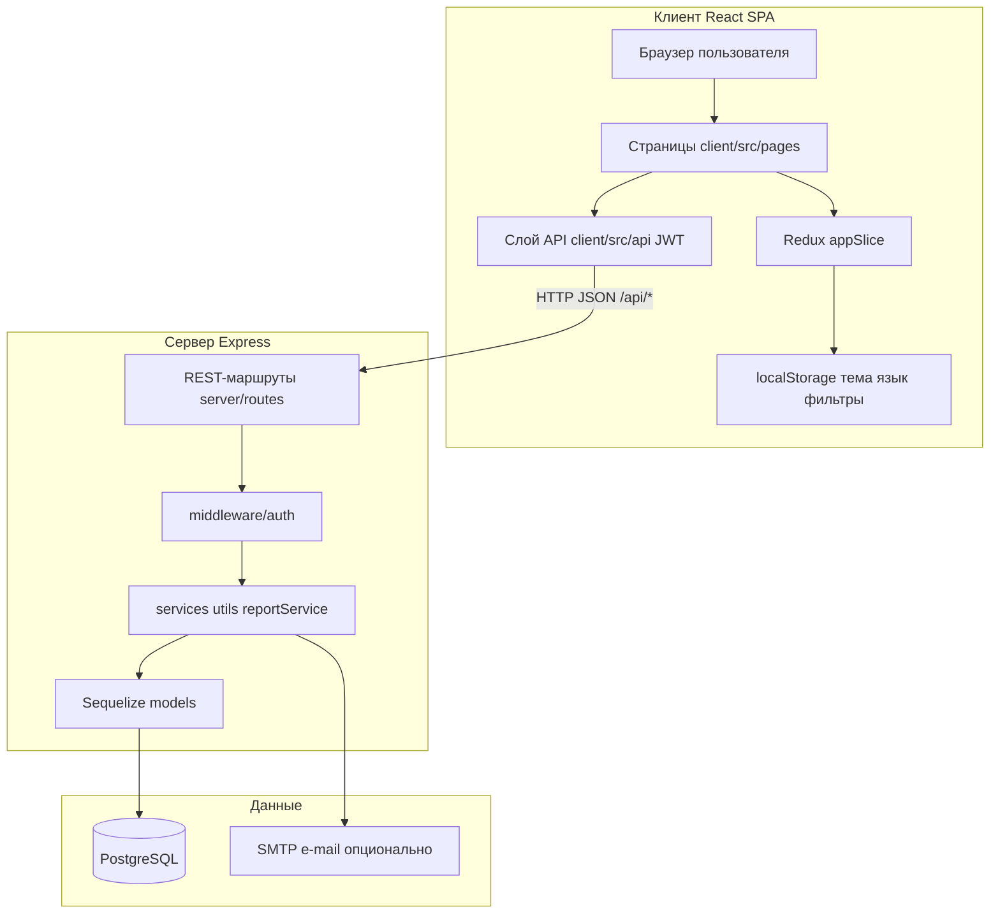
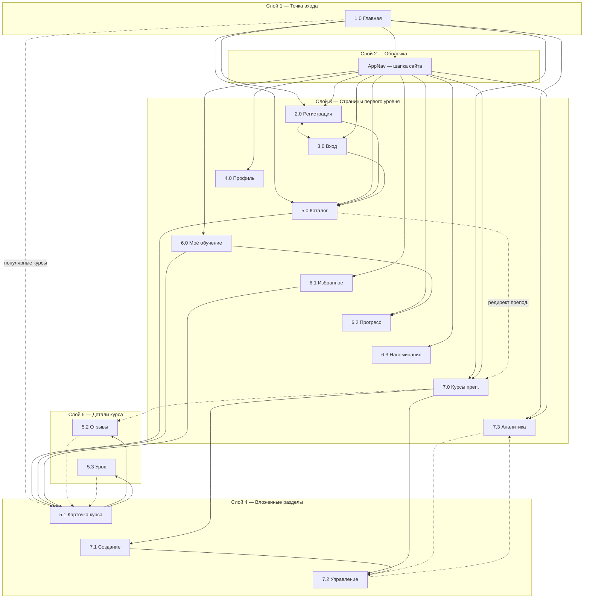

# Схема структуры приложения VSVH Languages

Платформа **VSVH Languages** — веб-приложение для изучения языков: SPA на **React** + **TypeScript**, REST API на **Node.js / Express**, данные в **PostgreSQL** (ORM **Sequelize**).

Роли в UI: **гость**, **студент**, **преподаватель**. Роль `ADMIN` есть в БД, отдельного интерфейса нет.

Оболочка страниц: `AppChrome` = `AppNav` + `Outlet` + `AppFooter`.

---

## 1. Общая архитектура системы

### API-префиксы

| Префикс | Назначение |
|---------|------------|
| `/api/auth` | Регистрация, вход, текущий пользователь |
| `/api/users` | Профиль, имя |
| `/api/courses` | Каталог, курс, отзывы, CRUD |
| `/api/courses/:courseId/lessons` | Уроки |
| `/api/courses/.../exercises` | Упражнения |
| `/api/enrollments` | Запись, отписка |
| `/api/submissions` | Ответы, история |
| `/api/certificates` | Сертификаты |
| `/api/favorites` | Избранное |
| `/api/reminders` | Напоминания |
| `/api/teacher` | Кабинет преподавателя, CSV |
| `/api/reports` | PDF, DOCX, e-mail |

---

## 2. Проектирование дизайна web-страниц (для пояснительной записки)

Полный текст раздела 2 (п. 2.1–2.4, рис. 2.1, текстовые прототипы, вайрфреймы и дизайн-макеты всех страниц) — в отдельном файле: [2-proektirovanie-dizajna-web-stranic.md](./2-proektirovanie-dizajna-web-stranic.md).

Ниже в этом документе — справочник маршрутов и техническая карта переходов для разработки (§3).

### Справочник страниц (код, маршрут)

| Код | Страница | Маршрут |
|-----|----------|---------|
| 1.0 | Главная | `/` |
| 2.0 | Регистрация | `/register` |
| 3.0 | Вход | `/login` |
| 4.0 | Профиль | `/me/profile` |
| 5.0 | Каталог курсов | `/courses` |
| 5.1 | Карточка курса | `/courses/:courseId` |
| 5.2 | Отзывы курса | `/courses/:courseId/reviews` |
| 5.3 | Урок | `/courses/:courseId/lessons/:lessonId` |
| 6.0 | Моё обучение | `/me/learning` |
| 6.1 | Избранное | `/me/favorites` |
| 6.2 | Прогресс | `/me/progress` |
| 6.3 | Напоминания | `/me/reminders` |
| 7.0 | Курсы преподавателя | `/teacher/courses` |
| 7.1 | Создание курса | `/teacher/courses/new` |
| 7.2 | Управление курсом | `/teacher/courses/:courseId` |
| 7.3 | Аналитика | `/teacher/analytics` |

---

## 3. Карта переходов (техническая справка для разработки)

Полный граф маршрутов React (`client/src/App.tsx`), включая возвраты «назад» и вторичные ссылки. Описание структуры и текстовые прототипы для пояснительной записки — в [2-proektirovanie-dizajna-web-stranic.md](./2-proektirovanie-dizajna-web-stranic.md).

Послойная схема (сверху вниз): слой 1 — главная; слой 2 — шапка; слой 3 — все страницы первого уровня (один ряд); слой 4 — 5.1, 7.1, 7.2; слой 5 — 5.2, 5.3. Сплошные стрелки — вниз или внутри слоя; пунктир — возврат или редирект.

---

## 4. Ссылки

- Раздел 2 ПЗ (структура и прототипы): [`2-proektirovanie-dizajna-web-stranic.md`](./2-proektirovanie-dizajna-web-stranic.md)
- Функции: [`tablitsa-funkcij-sajta.md`](./tablitsa-funkcij-sajta.md)
- БД: [`DATABASE.md`](./DATABASE.md)
- Страницы: [`PAGES_AND_FEATURES.md`](./PAGES_AND_FEATURES.md)
